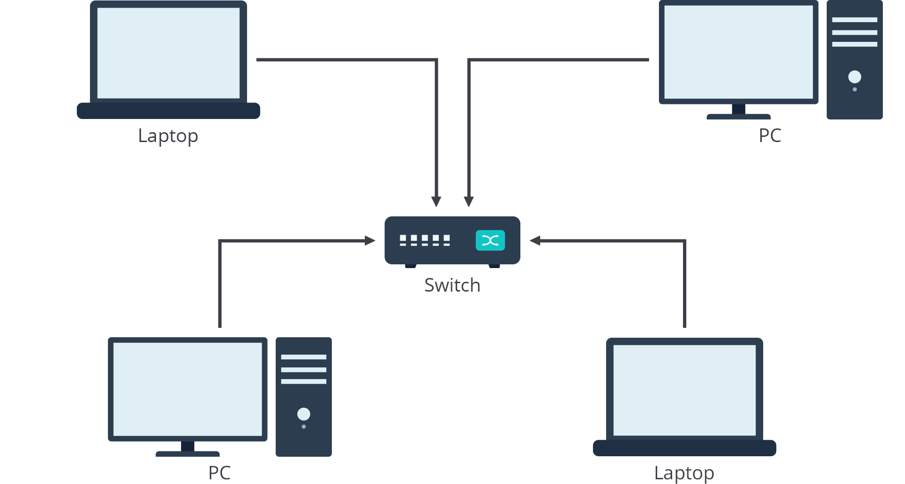
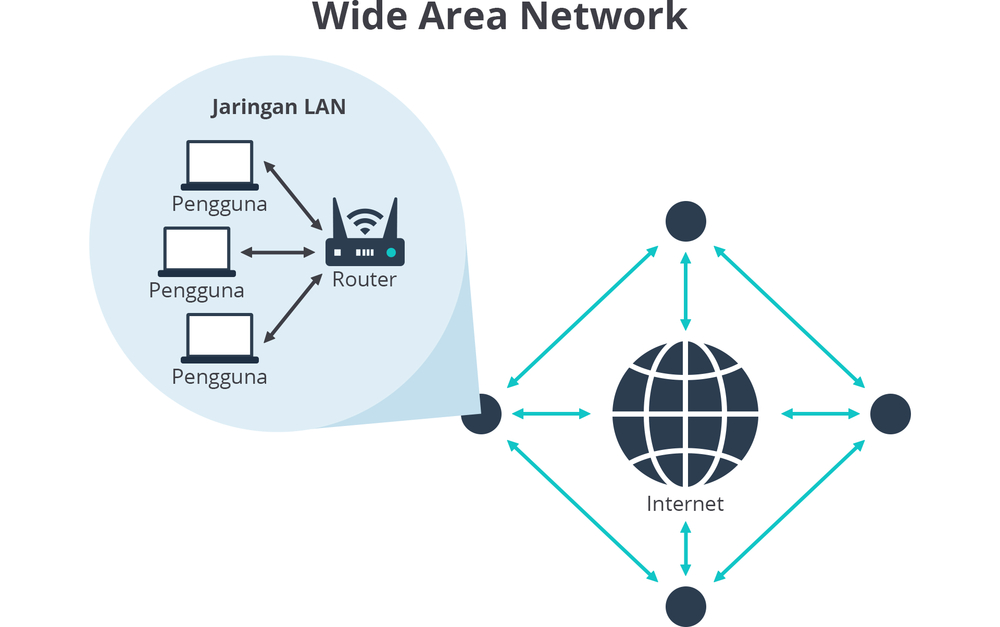
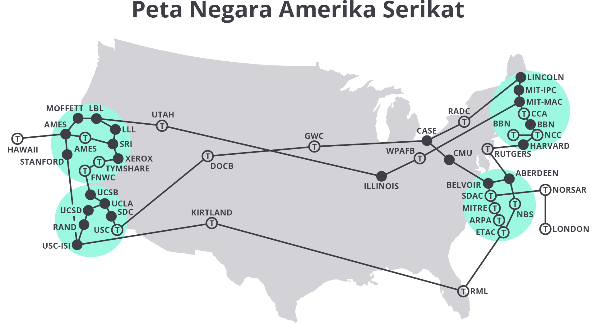
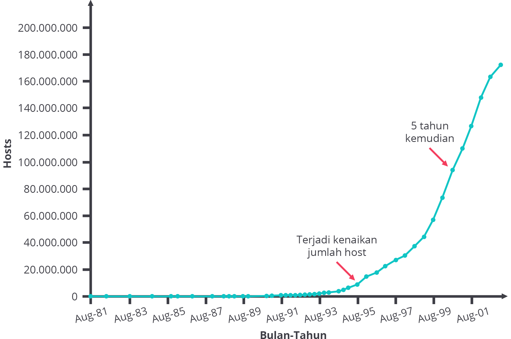
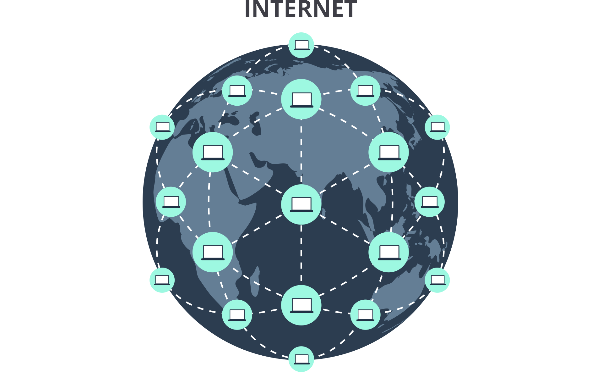
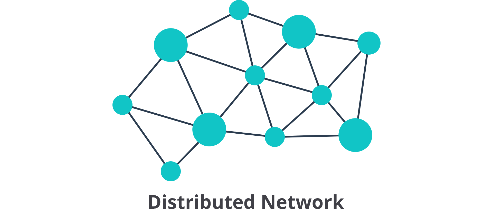
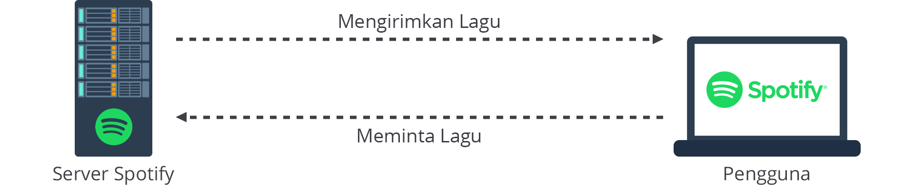

# Rangkuman Dasar-Dasar Jaringan Komputer


## Pengenalan Jaringan Komputer
Pada dasarnya, jaringan komputer–atau bisa disebut jaringan saja–adalah kumpulan (umumnya terdiri dari dua atau lebih) komputer atau perangkat keras lain yang saling terhubung, baik melalui kabel maupun nirkabel, sehingga memungkinkan mereka untuk bertukar informasi.

Jaringan komputer mirip seperti lingkungan sosial, di mana terdiri dari kumpulan orang yang saling mengenal, secara reguler bertukar informasi, dan mengoordinasikan kegiatan bersama. Mudah ‘kan memahaminya?

Sejatinya, Anda bisa kok membuat jaringan komputer sendiri secara sederhana menggunakan perangkat yang disebut switch untuk menghubungkan semua PC (Personal Computer) alias komputer pribadi yang Anda miliki satu sama lain. Voilà! Anda pun memiliki sebuah jaringan.



Masih terlalu rumit? Mari kita ambil contoh yang lebih mudah dan akrab dengan kehidupan sehari-hari. Hubungkanlah perangkat jemala nirkabel (headset wireless) dengan ponsel cerdas (smartphone) Anda. Ta-da! Anda pun berhasil membuat sebuah jaringan. Sederhana, ‘kan?


Pada contoh pertama, itu adalah bentuk dari LAN (Local Area Network), sedangkan yang kedua ialah PAN (Personal Area Network). Anda akan mempelajarinya lebih dalam di submodul selanjutnya.

Berikut adalah beberapa keuntungan atau manfaat terkait hadirnya jaringan komputer:

- Konektivitas dan komunikasi
- Berbagi data
- Akses internet
- Pengelolaan dan keamanan data

Tentunya masih amat banyak manfaat jaringan komputer yang lain. Namun, di submodul ini cukup itu saja yang perlu Anda ketahui. Bila masih penasaran apa saja manfaat-manfaat yang lain, Anda bisa mencarinya lebih lanjut di internet.


## Tipe-Tipe Jaringan Komputer
Sesungguhnya ada banyak tipe-tipe jaringan komputer di dunia ini, tetapi kita hanya akan mempelajari beberapa di antaranya saja yang memang umum dan kerap dijadikan acuan di pembelajaran jaringan. Kita akan mulai dari Personal Area Network, Local Area Network, Metropolitan Area Network, dan akhirnya Wide Area Network.

## Personal Area Network (PAN)
Personal Area Network alias PAN adalah tipe jaringan dengan cakupan terkecil dan sangat pribadi bagi penggunanya. PAN menghubungkan perangkat elektronik yang berada dalam jangkauan pengguna. Ukuran konektivitas PAN berkisar dari sekian sentimeter hingga beberapa meter (umumnya hingga 10 meter).

## Local Area Network (LAN)
Local Area Network, atau disingkat LAN, adalah jaringan komputer yang memiliki cakupan area geografis yang relatif kecil. Pada tipe jaringan ini, jarak komputer satu sama lain cukup berdekatan, seperti halnya di dalam satu kantor atau gedung yang sama.

Jumlah komputer yang terhubung dalam LAN dapat bervariasi, mulai dari hitungan jari, belasan, atau bahkan ratusan unit–selama komputer-komputer tersebut masih berada di satu wilayah yang bisa dijangkau oleh peralatan jaringan Anda.

## Metropolitan Area Network (MAN)
Metropolitan Area Network (MAN) adalah jaringan komputer yang menghubungkan komputer dalam area metropolitan, bisa berupa satu kota besar, beberapa kota besar dan kecil, atau area luas tertentu dengan banyak bangunan.

Cakupan MAN lebih besar dari LAN, tetapi lebih kecil dari WAN–akan kita bahas nanti. Meski namanya Metropolitan Area Network, tipe jaringan ini tidaklah mesti berada di perkotaan. Istilah “metropolitan” menyiratkan ukuran jaringan, bukan demografi wilayah yang dilayaninya.

Pada praktiknya, jaringan MAN sering kali digunakan untuk menghubungkan dua atau lebih jaringan LAN dalam satu kota yang sama yang jaraknya cukup jauh dan tidak dapat dihubungkan melalui kabel sederhana atau koneksi nirkabel.

Berikut adalah beberapa perusahaan dan organisasi yang sekiranya memerlukan jaringan MAN, antara lain:

- Institusi pemerintahan yang membutuhkan koneksi tepercaya untuk support kebutuhan data dan sistem.
- Institusi pendidikan yang membutuhkan koneksi untuk mendukung program sekolah online.
- ISP (Internet Service Provider) atau Penyedia Layanan Internet yang memerlukan koneksi dari atau ke IIX (Indonesia Internet Exchange).
- Perusahaan yang memerlukan koneksi berkapasitas besar dari atau ke DC (Data Center) dan DRC (Disaster Recovery Center).
- Perusahaan yang memerlukan koneksi dari atau ke Kantor Pusat dengan Kantor Cabang.
- Perusahaan yang memerlukan koneksi untuk sistem data cadangan atau untuk keperluan integrasi sistem IT antar departemen.

## Wide Area Network (WAN)
Laksana namanya, Wide Area Network (WAN) mencakup wilayah geografis yang sungguh luas hingga mampu menjangkau lintas provinsi, lintas negara, bahkan lintas benua; dan umumnya digunakan untuk menghubungkan dua atau lebih LAN yang jaraknya relatif berjauhan.



Salah satu contoh praktik penggunaannya adalah WAN kerap dimanfaatkan oleh perusahaan besar untuk menghubungkan semua jaringan kantor mereka, di mana setiap kantor biasanya memiliki jaringan LAN sendiri, dan LAN tersebut terhubung melalui WAN. Misal, perusahaan dapat memanfaatkan jaringan WAN untuk menghubungkan kantor cabang mereka yang berada di Jakarta dengan kantor pusat yang ada di Sydney.


## Sejarah Internet
Internet bermula dari jaringan kecil yang disebut ARPANET (Advanced Research Project Agency Network), dibangun oleh Departemen Pertahanan (Department of Defense) Amerika Serikat pada tahun 1969 untuk menghubungkan instalasi pertahanan.

Pada tahun 1973, protokol jaringan yang dipakai dari awal, yakni NCP (Network Control Protocol), digadang-gadang akan digantikan oleh TCP/IP (Transmission Control Protocol/Internet Protocol). NCP hendak diganti karena ia hanya mendukung komunikasi host-to-host (perangkat ke perangkat) dalam jaringan yang sama. Tentu saja itu tidak memenuhi kebutuhan yang pada saat itu menginginkan jaringan yang dinamis, terbuka, dan andal.

Pada tahun 1974, makin banyak jaringan yang terhubung dengan ARPANET. Beginilah rupa dari jaringan ARPANET pada tahun 1974.



Kemudian, TCP/IP distandardisasi dari tahun 1978 sampai 1981. Hingga akhirnya, pada tanggal 1 Januari 1983 (dikenal sebagai “flag day”), NCP secara resmi dianggap usang dan ARPANET mengubah protokol jaringan intinya dari NCP ke TCP/IP protocol suite yang lebih fleksibel dan kuat.

Selanjutnya, pada pertengahan 1980-an, ARPANET banyak digunakan oleh para researcher (peneliti) dan developer (pengembang). Namun, tak ayal, banyak komunitas dan organisasi dengan berbagai macam latar belakang pun ikut berperan, berpartisipasi, dan bergabung ke ARPANET.

Tak selang berapa lama, ARPANET mulai mencapai batas kemampuannya. Lantas, masuklah National Science Foundation (NSF) mendirikan jaringan nasional yang dirancang untuk menyediakan akses ke superkomputer besar (digunakan untuk menemukan bilangan prima baru dan menghitung orbit galaksi nan jauh di sana).

ARPANET secara resmi dinonaktifkan pada tahun 1990. Sementara itu, pada tahun 1995, NSFNET ditutup dan internet secara efektif diprivatisasi. Kala itu, jaringan telah menjadi “Internet”, yakni galaksi komunikasi baru yang siap untuk dieksplorasi dan dihuni sepenuhnya.

Internet kian berkembang, tetapi sayangnya jumlah komputer di internet tak bertambah di awal 1990-an.



Akan tetapi, sekitar Agustus 1995, ada sekitar 10 juta host di internet. Lima tahun berselang, tahun 2000-an, terjadi ledakan pada jumlah komputer yang begitu fenomenal di internet, yakni lebih dari 100 juta host.


## Cara Kerja Internet
### Internet di Balik Layar
Seperti yang sudah Anda ketahui, internet adalah kumpulan jaringan yang luas dan terhubung satu sama lain. Istilah "Internet" bisa dikatakan berasal dari konsep interconnected network (jaringan yang saling berhubungan).

Di internet, satu komputer terhubung dengan komputer yang lain dalam suatu jaringan, begitu pula satu jaringan terhubung dengan jaringan yang lain. Dengan demikian, sebuah komputer dapat berkomunikasi dengan komputer lain di jaringan yang jauh jaraknya berkat internet. Ini memungkinkan pertukaran informasi antarkomputer di seluruh dunia berlangsung dengan cepat.



Komputer bisa saling terhubung satu sama lain melalui kabel, gelombang radio, dan jenis infrastruktur jaringan lainnya. Semua data yang dikirim melalui internet–baik berupa gambar, pesan teks, atau email–diterjemahkan ke dalam kelip cahaya atau listrik (disebut juga "bit") yang kemudian ditafsirkan oleh komputer penerima. Kabel dan gelombang radio tersebut menghantarkan bit-bit ini dengan kecepatan cahaya. Makin banyak bit yang dapat melewati kabel dan gelombang radio dalam satu waktu, artinya makin cepat pula internet bekerja.

Data yang dikirim via internet dari komputer pengirim ke komputer tujuan akan bergerak melalui satu router ke router lainnya. Data dalam dunia komputer berbentuk bit. Bit merujuk pada sebuah digit dalam sistem angka biner yang ditunjukkan dengan nilai angka 1 dan 0, hanya itu. Tak penting apakah datanya berupa gambar, video, ataupun lagu, apa pun di internet direpresentasikan dan dikirim sebagai bit.

## Konsep Distributed Networking
Internet itu terbentuk dari jaringan independen dengan jumlah yang luar biasa banyak. Hal yang menarik tentang sistem ini adalah internet sepenuhnya terdistribusi. Sistem seperti ini disebut juga sebagai Distributed Networking alias Jaringan yang Terdistribusi.



Secara definisi, distributed networking adalah sistem jaringan yang saling berhubungan, tetapi independen, dan umumnya tersebar di beberapa lokasi geografis. Seperti itulah internet. Dengan kata lain, internet tidak bergantung pada mesin individu mana pun. Semua komputer atau perangkat yang dapat mengirim dan menerima data dengan cara yang benar (misal menggunakan protokol jaringan yang benar) bisa menjadi bagian dari internet.

Proses Pengiriman Data
Anggaplah Anda ingin memutar lagu di music streaming platform seperti Spotify melalui komputer. Mungkin di pandangan kita, komputer akan terhubung langsung ke server Spotify dan lantas mengirimkan lagu melalui jalur langsung dan khusus (direct and dedicated line).



Akan tetapi, nyatanya bukan seperti itu cara kerja internet. Andai kata internet punya koneksi semacam itu, tak mungkin rasanya untuk tetap menjaga semua sistem tetap berfungsi dengan normal selagi jutaan pengguna dalam waktu yang bersamaan menggunakan internet. Terlebih lagi, tidak ada jaminan bahwa setiap kabel dan komputer bekerja sepanjang waktu. Sebaliknya, data berjalan di internet secara tidak langsung (less direct). Apa maksudnya?

Proses pengiriman data di internet cukuplah menarik. Pasalnya, jalur yang ditempuh tak mesti tetap. Jalur data dapat berubah di tengah proses komunikasi antarkomputer berlangsung.

Data di internet berpindah dari satu komputer ke komputer lain dalam bentuk packet dan ia bergerak layaknya kita mengendarai mobil. Tergantung pada kemacetan lalu lintas atau kondisi jalan, kita mungkin akan memilih–atau terpaksa–mengambil rute yang berbeda setiap kali bepergian ke tempat yang sama.

Selain itu, sama halnya seperti kita bisa mengangkut segala macam barang di dalam mobil, banyak jenis data digital juga yang dapat dikirim menggunakan packet. Namun, tentunya ada beberapa batasan.


Bandwidth, Throughput, dan Latency
Bandwidth, throughput, dan latency adalah istilah yang saling berkaitan, tetapi masing-masing merujuk pada hal yang berbeda. Ketiganya kerap menimbulkan kebingungan bagi banyak orang, malah sering kali tertukar. Maka dari itu, simak dengan saksama ya!

Bandwidth
Bandwidth adalah kapasitas transmisi maksimum dari sebuah perangkat. Bandwidth diukur dengan bit rate, yakni jumlah bit yang dapat kita kirim selama periode waktu tertentu, biasanya diukur dalam detik, seperti Kbps (Kilobit per second), Mbps (Megabit per second), atau Gbps (Gigabit per second).

Throughput
Throughput adalah jumlah aktual data yang berhasil dikirim atau diterima melalui jaringan. Throughput disajikan dalam satuan Kbps, Mbps, atau Gbps. Jumlah data pada throughput dapat berbeda dari bandwidth karena berbagai masalah teknis, termasuk packet loss, jitter, latency, dan lainnya.

Latency
Latency atau latensi adalah jumlah waktu yang dibutuhkan data untuk berpindah dari titik asal ke titik tujuan dan kembali lagi ke titik asal (dikenal juga sebagai round trip atau perjalanan bolak-balik). Latensi sering kali dipakai untuk mengukur delay (penundaan) pada komunikasi client dan server.

---

# Rangkuman Model Jaringan


## Pengenalan Model Jaringan
Kita hanya akan membahas 2 model jaringan, yakni OSI dan TCP/IP.

### Model OSI
Model OSI (Open Systems Interconnection) adalah model jaringan teoretis yang diusulkan untuk menstandardisasi komunikasi antara perangkat melalui jaringan. Yang dimaksud teoritis adalah model ini tidak ada implementasi praktis. Ia hanyalah model konseptual yang menjelaskan bagaimana aplikasi dapat bekerja melalui jaringan.

Model OSI memiliki 7 layer yang menggambarkan bagaimana perangkat berkomunikasi satu sama lain.

- Application Layer (Layer 7)
  
    Application layer adalah layer ketujuh dari Model OSI. Layer ini merupakan satu-satunya layer yang berinteraksi langsung dengan data dari pengguna. Sebagai contoh, saat Anda membuka www.dicoding.com, application layer-lah bertanggung jawab untuk menyiapkan HTTP request yang akan dikirim melalui jaringan, misal menambahkan header dan cookie yang diperlukan.

- Presentation Layer (Layer 6)

    Presentation layer bertanggung jawab untuk mengonversi data agar sistem yang menggunakan format data yang berbeda dapat bertukar informasi.

- Session Layer (Layer 5)

    Session layer bertanggung jawab untuk membuka, menjaga, dan menutup sesi komunikasi alias session. Session adalah durasi koneksi antara pengirim dan penerima tetap terbuka.

- Transport Layer (Layer 4)

    Transport layer adalah tempat di mana data dipecah menjadi bagian-bagian yang lebih kecil, disebut juga sebagai segment. Transport layer memiliki tanggung jawab untuk memastikan keandalan pengiriman segment data di jaringan. Data yang dikirim mestilah terkirim tanpa corrupt (rusak). Jika tidak, data tersebut akan dikirim ulang.

- Network Layer (Layer 3)

    Network layer bertugas untuk memecah segment ke dalam paket (packet). Layer ini juga menetapkan alamat IP sumber (source IP address) dan alamat IP tujuan (destination IP address) untuk masing-masing packet.

- Data Link Layer (Layer 2)

    Data link layer bertanggung jawab untuk memecah packet ke dalam frame. Selain itu, data link layer juga akan menetapkan source MAC address dan destination MAC address ke masing-masing frame.

- Physical Layer (Layer 1)

    Layer terakhir dari model OSI adalah physical layer yang melibatkan semua perangkat keras, seperti router, kabel, dan switch. Di layer ini, frame diubah menjadi aliran bit (1 dan 0) dan kemudian dikirim ke penerima.

### Model TCP/IP
Model TCP/IP memiliki 5 layer. Mari kita bahas satu per satu.

- Application layer (Layer 5)

    Application layer dalam model TCP/IP menggabungkan sebagian besar fungsi yang dilakukan oleh session layer dan presentation layer dari model OSI.

- Transport layer (Layer 4)

    Transport layer bertanggung jawab untuk memilah program client dan server mana yang seharusnya mendapatkan data. Protokol yang digunakan di layer ini adalah TCP (Transmission Control Protocol) dan UDP (User Datagram Protocol).

- Network layer (Layer 3)

    Network layer memungkinkan jaringan yang berbeda untuk berkomunikasi satu sama lain melalui perangkat yang dikenal sebagai router. Layer ini bertanggung jawab untuk mengirimkan data ke seluruh kumpulan jaringan.

- Data link layer (Layer 2)

    Layer kedua dalam model TCP/IP dikenal sebagai data link layer. Data link layer bertanggung jawab untuk mendefinisikan cara umum untuk menafsirkan sinyal sehingga perangkat jaringan dapat berkomunikasi satu sama lain.

- Physical layer (Layer 1)

    Serupa dengan namanya, layer ini mewakili perangkat fisik yang menghubungkan komputer di jaringan, termasuk spesifikasi untuk kabel jaringan dan konektor yang menghubungkan perangkat, serta spesifikasi yang menjelaskan bagaimana sinyal dikirim melalui koneksi tersebut.


### Mengenal Protokol Jaringan pada Model TCP/IP
Kumpulan standar atau aturan yang ditetapkan dan harus diikuti oleh komputer agar dapat berkomunikasi dengan benar disebut protokol.

Jaringan komputer memastikan bahwa setiap komputer dapat mendengar satu sama lain, saling berkomunikasi melalui protokol yang komputer lain juga mengerti, mengulangi pesan yang tidak terkirim secara utuh, dan berbagai hal lainnya. Persis layaknya manusia berkomunikasi.

Oke, kini Anda sudah mengerti soal konsep protokol. Selanjutnya, kita akan menilik lebih lanjut protokol-protokol di setiap layer pada model TCP/IP. Siap? Let’s go!

### Application Layer
Application layer merupakan layer paling atas dalam model TCP/IP. Layer ini memungkinkan pengguna untuk berinteraksi dengan aplikasi.

Berikut ini adalah protokol utama yang digunakan pada application layer, antara lain HTTP, HTTPS, SMTP, DNS, FTP, dan Telnet.

### Transport Layer
Transport layer bertanggung jawab atas keandalan, kontrol aliran, dan koreksi data yang dikirim melalui jaringan. Dua protokol yang digunakan pada layer ini adalah TCP dan UDP. Mari kita tengok keduanya.

- TCP

    TCP (Transmission Control Protocol) adalah protokol yang connection-oriented alias berorientasi koneksi. Artinya, TCP akan memastikan bahwa setiap packet dikirimkan–jika memungkinkan–dengan membuat koneksi ke perangkat penerima. Jika sebuah paket tidak tiba di tujuan, TCP akan mengirim ulang paket tersebut. Koneksi akan ditutup hanya setelah paket berhasil dikirim dengan sukses atau terjadi kondisi kesalahan yang tidak dapat dipulihkan. Dengan demikian, TCP termasuk protokol yang andal.

- UDP

    UDP (User Datagram Protocol) adalah protokol yang bersifat connectionless (tanpa koneksi). Maksudnya, UDP tidak memverifikasi koneksi antara komputer pengirim dan komputer penerima. Setelah UDP menerima dan memproses packet, ia kemudian akan melupakannya. UDP juga tidak menjamin bahwa packet tadi akan tiba di tujuannya.

### Network Layer
Tanggung jawab utama dari network layer adalah menerima dan mengirim packet melalui jaringan. Protokol di layer ini mencakup IP (Internet Protocol), ARP (Address Resolution Protocol), dan Internet Control Message Protocol (ICMP).

- IP

    IP (Internet Protocol) adalah protokol yang bertanggung jawab untuk mengirimkan packet ke perangkat jaringan. Protokol ini menggunakan IP address ketimbang alamat fisik (MAC) untuk merujuk ke perangkat individu. ARP-lah (nanti kita bahas) yang menangani tugas mengubah IP address ke MAC address.

- ARP

    ARP (Address Resolution Protocol) bertugas untuk membantu IP dalam mengarahkan packet ke komputer penerima yang sesuai dengan memetakan MAC address ke IP address.

- ICMP

    ICMP (Internet Control Message Protocol) bertanggung jawab untuk mendeteksi dan melaporkan kesalahan jaringan sekaligus menyediakan pembaruan status. Misalnya, jika router tidak dapat mengirimkan paket, ia akan mengirim pesan ICMP kembali ke sumber paket.

### Data Link Layer
Data link layer bertugas untuk mengidentifikasi jenis protokol jaringan pada packet. Layer ini juga menyediakan error control (kontrol kesalahan) dan framing (pembuatan frame).

Berikut beberapa contoh protokol, standar, dan implementasi pada data link layer:.

- Ethernet

    Ethernet merupakan keluarga teknologi jaringan komputer kabel yang biasa digunakan di Local Area Network (LAN), Metropolitan Area Network (MAN), dan Wide Area Network (WAN).

- Frame Relay

    Frame Relay adalah teknologi Wide Area Network (WAN) standar yang menentukan physical layer dan data link layer dari saluran telekomunikasi digital menggunakan metodologi packet switching. Awalnya dirancang untuk transportasi melintasi Integrated Service Digital Network (ISDN), kini dapat digunakan untuk banyak antarmuka jaringan lainnya.

- Token Ring

    Token Ring adalah teknologi jaringan komputer yang digunakan untuk membangun Local Area Network. Token Ring diperkenalkan oleh IBM pada tahun 1984 dan distandardisasi pada tahun 1989 sebagai IEEE 802.5.

- IEEE 802.11

    IEEE 802.11 adalah bagian dari standar IEEE 802 yang menetapkan kumpulan protokol dari MAC dan physical layer untuk mengimplementasikan komunikasi komputer Wireless Local Area Network (WLAN).

- PPP

    PPP (Point-to-Point Protocol) adalah protokol yang digunakan untuk menghubungkan satu sistem komputer ke sistem komputer lainnya. Komputer menggunakan PPP untuk berkomunikasi melalui jaringan telepon atau internet.

### Physical Layer
Physical layer memiliki tanggung jawab untuk menentukan karakteristik perangkat keras yang akan digunakan untuk jaringan. Layer ini menjelaskan standar perangkat keras seperti IEEE 802.3 (spesifikasi untuk media jaringan Ethernet) dan RS-232 (spesifikasi untuk konektor pin standar).

Berikut beberapa teknologi yang menyediakan layanan pada physical layer:

- Bluetooth physical layer

    Bluetooth adalah standar teknologi nirkabel jarak pendek yang digunakan untuk pertukaran data antarperangkat menggunakan gelombang radio UHF di ISM band dari 2,402 GHz hingga 2,48 GHz. Dengan bluetooth, artinya Anda sudah bisa membangun Personal Area Network (PAN)

- DSL physical layer

    DSL (Digital Subscriber Line) merupakan teknologi yang digunakan untuk mengirimkan data digital melalui saluran telepon. Dalam pemasaran telekomunikasi, istilah DSL secara luas dipahami sebagai Asymmetric Digital Subscriber Line (ADSL), yakni teknologi DSL yang paling umum dipasang untuk akses Internet.

- Ethernet physical layer

    Ethernet physical layer adalah fungsionalitas physical layer dari famili Ethernet yang diterbitkan oleh Institute of Electrical and Electronics Engineers (IEEE).

- SONET dan SDH physical layer

    Synchronous optical networking (SONET) dan Synchronous Digital Hierarchy adalah protokol standar untuk mentransfer beberapa aliran bit digital secara sinkron melalui fiber optic (serat optik) menggunakan laser atau cahaya yang sangat koheren dari LED (light-emitting diode).

- Modem physical layer

    Modem (modulator-demodulator) adalah sebuah perangkat keras komputer untuk mengubah data dari format digital ke dalam bentuk yang sesuai untuk analog, seperti telepon atau radio.

- USB physical layer

    USB (Universal Serial Bus) adalah standar industri yang menetapkan spesifikasi kabel, konektor, dan protokol untuk koneksi, komunikasi, dan catu daya antara komputer, periferal, dan komputer lain. Ada banyak variasi rentetan perangkat keras USB, USB-C adalah yang paling terkini.


## Komunikasi Data pada Model TCP/IP
Sekarang kita akan melihat bagaimana komunikasi data yang terjadi pada model TCP/IP supaya Anda makin paham lagi tentang model ini. Siapkan ancang-ancang, mari kita langsung mulai.

Katakanlah kita ingin membuka website www.dicoding.com melalui web browser yang sudah terhubung ke jaringan (dalam hal ini adalah internet). Itu berarti, web browser berada di sisi client, sementara web server milik Dicoding ada di sisi server. Ini dinamakan komunikasi client-server. Oke, lantas apa yang akan terjadi selanjutnya?

- Application layer

    Layer pertama yang akan berinteraksi dengan browser adalah application layer. Layer ini mendefinisikan komunikasi antara aplikasi yang ada di komputer pengirim (client) dan aplikasi di komputer penerima (server).


- Transport Layer

    Transport layer memiliki tanggung jawab untuk memecah data (message) yang diterima menjadi potongan yang lebih kecil yang disebut segment (jika menggunakan TCP) atau datagram (jika menggunakan UDP).

    Katakanlah web server dicoding memiliki proses yang berjalan pada port 80. Ketika client menyiapkan HTTP request, ia akan menambahkan TCP header. TCP header berisi banyak hal, sekian di antaranya adalah source port (port sumber) dan destination port (port tujuan). Anggap saja source port dalam skenario kita adalah port 7268, sedangkan source destination-nya adalah port 80.


- Network Layer

    Di network layer, data (segment) akan dipecah menjadi potongan yang lebih kecil yang disebut packet. Packet yang dihasilkan bisa jadi satu atau mungkin banyak, tergantung pada berapa banyak data yang ada.

    Tugas dari layer ini adalah untuk memastikan bahwa data dari satu komputer (client) dapat menemukan jalan ke komputer tujuan (server). Untuk melakukan itu, sebuah IP header yang berisi source IP (IP sumber) dan destination IP (IP tujuan) ditambahkan ke setiap packet.

    Jalur dari client ke server mungkin saja melintasi banyak jaringan. Oleh karenanya, packet membutuhkan peran dari perangkat jaringan router untuk berpindah dari satu jaringan ke jaringan yang lain. Inilah yang dinamakan routing (perutean).


- Data Link Layer

    Data link layer bertanggung jawab untuk pengiriman lalu lintas pada satu segmen jaringan atau LAN, dalam istilah TCP/IP berarti pengiriman dalam satu subnet. Data (packet) dari layer sebelumnya akan dipecah menjadi bagian yang lebih kecil yang disebut frame.

    Kemudian, frame tersebut akan ditambahkan sebuah header yang berisi source MAC address (MAC address sumber) dan destination MAC address (MAC address tujuan). Bagi Anda yang belum familier, MAC address adalah alamat yang ditetapkan dan dimiliki oleh setiap perangkat fisik.


- Physical Layer

    Sesuai namanya, physical layer bertanggung jawab untuk mengirim dan menerima data secara fisik. Ada banyak caranya, bisa melalui gelombang radio (Wi-Fi), sinyal cahaya (Fiber optic), dan lain-lain. Data yang tadi dikirim dari data link layer kemudian di-encode (dikodekan) ke dalam bit (1 dan 0), lalu ditransmisikan melalui media fisik.

---

# Rangkuman IP Address


## Pengenalan IP Address
Semua perangkat yang terhubung ke internet masing-masing memiliki alamat yang unik. Alamat di internet hanyalah sebuah angka, tetapi unik dan berbeda-beda untuk setiap komputer atau perangkat jaringan. Konsepnya mirip seperti alamat rumah. Jika Anda ingin mengirim surat ke kawan, yang harus Anda ketahui pasti adalah alamat rumahnya, bukan? Selain itu, Anda juga mengerti bagaimana cara menulis alamat dengan benar sehingga surat tersebut dapat dibawa oleh petugas pos ke tujuannya dengan tepat.

Sistem pengalamatan untuk komputer di internet pun serupa dengan itu. Salah satu protokol terpenting yang digunakan dalam komunikasi di internet adalah IP (Internet Protocol) dan alamat komputer disebut IP address. IP address digunakan untuk pengalamatan packet sehingga mereka dapat melakukan perjalanan melintasi jaringan dan tiba di tujuan yang benar.

Bentuk IP address yang kita bahas adalah IPv4. IPv4 address memiliki panjang 32 bit yang terdiri dari 4 oktet, di mana setiap oktet biasanya dituliskan dalam angka desimal. 8 bit data (atau satu oktet) mewakili angka desimal dari 0 hingga 255.

Misalnya, 12.34.56.78 merupakan IPv4 address yang valid, sementara 123.456.789.100 tidak. Pasalnya, 123.456.789.100 memiliki angka yang lebih besar daripada yang dapat diwakili oleh 8 bit.

Format ini dikenal sebagai dotted decimal notation alias notasi desimal bertitik. Kita akan pelajari hal ini lebih jauh nanti dalam submodul konsep subnetting.


## Masalah pada IPv4
Saat ini internet sedang mengalami masalah yang cukup besar. Salah satu masalah utama adalah kita kehabisan IPv4 address. Seperti yang kita pelajari sebelumnya, IPv4 address memiliki panjang 32 bit. Artinya, ia hanya memiliki 232 atau sekitar 4 miliar IP address.

Bila dibayangkan sekilas, mungkin angka 4 miliar begitu besar ya. Akan tetapi, seperti yang dikisahkan pada modul pertama soal sejarah internet, internet ternyata jauh lebih populer daripada yang dibayangkan saat awal mula diciptakan. Faktanya, 4 miliar IP address tidaklah cukup.

Nah, masalah kehabisan IPv4 address dimulai pada 31 Januari 2011. Saat itu, IANA mengalokasikan 2 blok IPv4 address ke APNIC, yang kemudian memicu kebijakan global untuk mengalokasikan sisa kumpulan alamat yang dimiliki IANA di antara lima RIR secara merata.

Tak selang lama kemudian, Number Resource Organization (NRO) mengumumkan bahwa kumpulan IPv4 address sudah sepenuhnya habis. Ini artinya sudah tidak ada lagi IPv4 address yang tersedia untuk pengalokasian dari IANA ke lima RIR.

Setelah itu, lambat laun akhirnya semua RIR pun kehabisan kumpulan IPv4 address, kecuali yang disimpan untuk transisi ke IPv6 (akan kita bahas nanti). Peristiwa ini terjadi pada 15 April 2011 untuk APNIC, 10 Juni 2014 untuk LACNIC, 24 September 2015 untuk ARIN, 21 April 2017 untuk AFRINIC, dan 25 November 2019 untuk RIPE NCC.


## Solusi untuk IPv4
### Solusi 1: CIDR
CIDR atau Classless Inter-Domain Routing adalah metode untuk mengalokasikan IP address dan untuk perutean IP. Sebuah organisasi bernama Internet Engineering Task Force (IETF) memperkenalkan CIDR pada tahun 1993, di mana salah satu tujuannya adalah untuk membantu memperlambat masalah kehabisan IPv4, dan itu berhasil!

Selain itu, pengadopsian CIDR ini juga dimaksudkan untuk menggantikan metode pengalamatan sebelumnya, yakni classful addressing. Oke, sebelum kita lebih dalam membahas CIDR atau classless, mari kita tilik dulu sekilas tentang pengalamatan dengan metode classful yuk agar Anda memahami konteks materi yang disampaikan.

CIDR merupakan pendekatan yang lebih fleksibel untuk mendeskripsikan rentang IP address. Saat berbicara tentang CIDR, kita akan sering menemukan notasi garis miring yang dikenal sebagai CIDR notation.

Butuh contoh? Oke, mari kita ambil contoh IP address yang sama seperti sebelumnya, yakni 9.100.100.100. Katakanlah IP address ini memiliki subnet mask 255.255.255.0. Nah, berkat CIDR notation, IP address tersebut kini dapat ditulis sebagai 9.100.100.100/24. Karena sekarang kita tidak lagi peduli dengan classful addressing, yang kita butuhkan kini adalah network mask untuk menentukan network ID. Dalam contoh kita, berarti network ID-nya adalah 9.100.100.x, sedangkan host ID-nya adalah x.x.x.100.

### Solusi 2: NAT
NAT alias Network Address Translation adalah sebuah teknik di mana satu IP address diterjemahkan ke IP address yang lain. NAT telah digunakan banyak pihak untuk berbagai tujuan, mulai dari perlindungan keamanan hingga membantu memperlambat masalah kehabisan IPv4 address. Di modul ini, kita hanya akan fokus membahas NAT dari sisi fungsinya sebagai solusi untuk masalah kehabisan IPv4 address.

NAT menerjemahkan private IP address ke public IP address. Dengan demikian, meski kita memiliki banyak perangkat di rumah dan semua terhubung ke internet (misal melalui Wi-Fi), mereka hanya akan memiliki satu public IP address.

Berkat hadirnya NAT, kini kita bisa memiliki ratusan bahkan ribuan perangkat yang menggunakan private IP address, tetapi semuanya dapat terhubung ke internet hanya dengan satu public IP address.

### Solusi 3: IPv6
Pada pertengahan 1990-an, masalah habisnya IPv4 address sudah menjadi perhatian banyak pihak. Oleh sebab itu, IP versi baru pun dikembangkan, yakni Internet Protocol version 6 (IPv6).

Perbedaan terbesar antara IPv4 dan IPv6 adalah jumlah bit pada alamatnya. Tentu Anda masih ingat bahwa IPv4 address memiliki total 32 bit, yang artinya mungkin ada sekitar 4 miliar IP address yang bisa digunakan.

Lantas, bagaimana dengan IPv6? IPv6 address berukuran 128 bit. Ini merupakan hal yang mencengangkan! Apabila kita hitung, 2128 berarti menghasilkan angka yang sangat panjang, yaitu 39 digit. Rentang angka ini disebut Undecillion.

IPv6 address berukuran 128 bit, biasanya ditulis dalam 8 grup, masing-masing grup berukuran 16 bit, dan setiap grup tersebut terdiri dari 4 bilangan heksadesimal.

Seperti inilah bentuk IPv6 address secara lengkap:

2001:0db8:0000:0000:0000:ff00:0012:3456


## Konsep Subnetting
Dalam istilah yang paling dasar, subnetting adalah proses membagi jaringan besar menjadi beberapa jaringan yang lebih kecil yang disebut segmen jaringan atau subnetwork/subnet.

Subnet adalah bagian dari suatu jaringan. Sebagai contoh, Jaringan A memiliki blok IP 172.16.0.0/16. Itu artinya, jaringan tersebut memiliki rentang IP address yang begitu besar, yakni dari 172.16.0.0 hingga 172.16.255.255 atau sekitar 65.536 IP address.

Nah, alih-alih memiliki satu jaringan yang besar, kita bisa membuat bagian yang lebih kecil (subnet) dari jaringan tersebut, misal 172.16.1.0/24. Jadi, subnet 172.16.1.0/24 merupakan bagian dari Jaringan A 172.16.0.0/16. Itulah mengapa disebut subnet.


## Subnet Mask
Subnet mask adalah angka yang menyerupai IP address, tetapi dengan fungsi yang berbeda. Subnet mask menjelaskan berapa banyak bit dalam IP address yang digunakan untuk network ID dengan menutupi bagian network ID itu sendiri.

Contoh, IP address 192.168.1.0 dengan subnet mask 255.255.255.0 menerangkan bahwa network ID pada IP address tersebut adalah 192.168.1.x. Oh ya, tahukah Anda? Di dunia komputer dan jaringan, IP address dan subnet mask dalam format desimal seperti ini sesungguhnya tidak ada artinya, lo. Pasalnya, komputer dan jaringan hanya memahami angka dalam format bilangan biner, yaitu 1 dan 0. Ini disebut juga sebagai bit.

Subnet mask dapat ditulis menggunakan cara yang lebih pendek yang disebut CIDR notation (sudah kita pelajari). Ini dilakukan dengan menulis garis miring (slash) diikuti total bilangan biner “1” yang ada di subnet mask. Misalnya, pada contoh IP address dan subnet mask sebelumnya (192.168.1.0 dan 255.255.255.0), kita bisa tuliskan secara lebih singkat sebagai 192.168.1.0/24.


## Studi Kasus: Subnetting
Katakanlah Anda bekerja pada perusahaan rintisan X. Perusahaan ini memiliki sebuah private network (jaringan pribadi) dengan blok IP 192.168.1.0/24. Dari blok IP tersebut, perusahaan meminta Anda untuk mencari tahu beberapa hal berikut:

1. Berapa subnet mask-nya?
2. Mana bagian network ID dan host ID-nya?
3. Berapa subnet yang bisa dibuat?
4. Berapa jumlah host yang bisa dipakai per subnet?

Yuk langsung meluncur ke jawaban!

1. Subnet Mask
Dengan melihat blok IP 192.168.1.0/24, kita bisa fokus pada CIDR notation-nya, yakni /24. Itu artinya, ada 24 angka “1” dalam bilangan biner. Jadi, subnet mask-nya adalah sebagai berikut: 11111111.11111111.111111111.0000000.


2. Network ID dan Host ID
Setelah mengetahui subnet mask, kini kita bisa mengidentifikasi mana bagian network ID dan mana bagian host ID. Simpel, dalam kasus ini, setiap oktet pada IP address yang selaras dengan angka 1 pada subnet mask dalam biner adalah network address (network ID), sisanya host ID.

192.168.1.0
11111111.11111111.111111111.0000000

Jadi, 192.168.1.x adalah network ID, dan x.x.x.0 adalah host ID.


3. Jumlah Subnet
Untuk menghitung jumlah subnet, kita bisa menggunakan rumus 2x (di mana x adalah banyaknya angka 1 dalam oktet terakhir di subnet mask). Mari kita hitung.

Dari subnet mask 11111111.11111111.111111111.0000000, oktet terakhirnya adalah 0000000. Karena tidak ada angka 1 di sana, berarti 20 = 1. Jadi, dalam kasus kita, subnet yang bisa dibuat hanyalah 1.

Contoh lain, apabila subnet mask-nya adalah /27 atau 11111111.11111111.11111111.11100000, maka 23 = 8 subnet.


4. Jumlah Host per Subnet
Jumlah host per subnet bisa kita ketahui melalui rumus (2y)-2 (di mana y adalah banyaknya angka 0 dalam oktet terakhir di subnet mask). Begini perhitungannya.

Dari subnet mask 11111111.11111111.111111111.0000000, oktet terakhirnya adalah 0000000. Itu artinya, (28)-2 = 256-2 = 254 host per subnet.

Coba kita pakai contoh yang berbeda. Apabila subnet mask-nya adalah /27 atau 11111111.11111111.11111111.11100000, maka (25)-2 = 32-2 = 30 host per subnet.

Mungkin saat ini ada pertanyaan yang mengganjal di hati Anda, “Kenapa harus dikurangi 2?” Jawabannya karena ada 2 IP address yang tidak bisa dipakai oleh host, yakni network address dan broadcast address.

Dalam kasus 192.168.1.0/24, network address-nya adalah 192.168.1.0 dan broadcast address-nya adalah 192.168.1.255. Kita akan pelajari keduanya di modul yang akan datang.

Jadi, rentang IP address yang valid untuk host adalah 192.168.1.1–192.168.1.254.

Catatan: Di beberapa kasus, rumus menghitung host per subnet tidak selalu dikurangi 2, bisa jadi dikurangi 3, 4, bahkan 5. Ini karena beberapa IP address dari host ID digunakan untuk gateway router, DNS server, atau bahkan disimpan untuk penggunaan di masa mendatang.

Itulah studi kasus kita dalam materi subnetting. Perlu Anda ingat bahwa dunia subnetting itu luas. Masih banyak contoh-contoh lain yang mungkin levelnya lebih rumit dan kompleks. Namun, untuk saat ini, itu saja yang perlu Anda ketahui.


## Gambaran Umum tentang DHCP
DHCP adalah protokol application layer yang bertugas untuk mengotomatiskan proses konfigurasi host (perangkat) di suatu jaringan. Dengan DHCP, host dapat meminta IP address ke DHCP server saat terhubung ke jaringan dan kemudian menerima semua konfigurasi jaringan yang diperlukan.

Ada beberapa metode bagaimana DHCP beroperasi, di antaranya adalah dynamic allocation, automatic allocation, dan fixed allocation. Mari kita arungi satu per satu.

- Dynamic allocation
Metode yang satu ini adalah yang paling umum dan bekerja seperti pada gambar di atas. Jadi, rentang IP address akan ditetapkan untuk perangkat client. Nantinya, salah satu IP address tersebut akan diberikan jika ada client yang memintanya. Dengan dynamic allocation, IP address untuk masing-masing komputer bisa berbeda-beda setiap kali terhubung ke jaringan.


- Automatic allocation
Metode ini mirip dengan dynamic allocation, yakni rentang IP address ditetapkan untuk nantinya diberikan ke client. Perbedaan utamanya, dalam metode automatic allocation DHCP server diminta untuk melacak IP address mana yang ditetapkan untuk perangkat client tertentu di masa lalu. Dengan menggunakan informasi tersebut, DHCP server akan menetapkan IP address yang sama ke client yang sama setiap kali diminta.


- Fixed allocation
Jika ingin menggunakan metode fixed allocation, kita perlu membuat daftar MAC address setiap perangkat beserta IP address yang sesuai secara manual.

  Saat client meminta IP address, DHCP server akan mencari MAC address si client di dalam tabel. Jika ketemu, DHCP server kemudian memberikan IP address yang cocok/sesuai.
Namun, apabila MAC address tidak ditemukan, DHCP server akan menggunakan metode dynamic atau automatic allocation. Bahkan, mungkin saja tidak memberikan IP address sama sekali. Dengan begitu, metode ini bisa digunakan untuk meningkatkan keamanan dengan memastikan bahwa hanya perangkat yang memiliki MAC address terdaftar saja yang akan memperoleh IP address dan berkomunikasi di jaringan.


## Reserved IPv4 Address
### Network Address
Network address menunjukkan mana bagian network ID dan mana host ID. Misalnya, pada contoh IP address 192.168.10.0/24:

- 192.168.10.x adalah bagian network ID, dan
- x.x.x.0 adalah bagian host ID, yang merepresentasikan semua host yang ada di jaringan.

Network address kerap dipakai untuk menunjukkan rentang IP address pada suatu network (jaringan) atau subnet (segmen jaringan). Sebagai contoh, jika suatu jaringan memiliki blok IP 192.168.10.0/24, itu artinya ia bisa menampung host mulai dari 192.168.10.1 hingga 192.168.10.254, di mana 192.168.10.0 adalah network address dan 192.168.10.255 adalah broadcast address (akan kita bahas di submodul ini nanti).

## Private IP Address
Beberapa IP address yang termasuk dalam kategori private IP address tidak dapat dirutekan oleh router di internet. Ia hanya bisa digunakan untuk jaringan pribadi, kampus, perusahaan, atau jaringan apa pun yang tidak terhubung ke internet.

Berikut adalah beberapa rentang alamat yang terdaftar sebagai private IP address:

| Blok IPv4 Address | Rentang Alamat |
| ----------- | ----------- |
| 10.0.0.0/8 | 10.0.0.0–10.255.255.255 |
| 172.16.0.0/12 | 172.16.0.0–172.31.255.255 |
| 192.168.0.0/16 | 192.168.0.0–192.168.255.255 |

Dengan menggunakan private IP address dalam LAN, kebutuhan IPv4 address secara global telah menurun secara signifikan, yang berarti berhasil membantu menunda habisnya IPv4 address.

### Loopback IP Address
Blok IP address 127.0.0.0/8 (atau jika ditulis dalam rentang IP address berarti 127.0.0.0–127.255.255.255) ditujukan untuk loopback, yaitu alamat dirinya sendiri. Loopback IP address juga dikenal sebagai localhost address (mungkin sebagian dari Anda lebih familier).

### Link-local Address
Submodul sebelumnya telah menerangkan tentang DHCP yang bertugas untuk memberikan IP address ke client atau host secara dinamis. Nah, mungkin Anda bertanya-tanya, “Bagaimana jika ternyata sebuah host tidak memperoleh IP address dari DHCP server dan belum diberikan IP address apa pun secara manual?” Di sinilah Anda akan menemukan jawabannya.

Jadi, host dapat menetapkan IP address sendiri dari rentang Link-local address yang berkisar dari 169.254.0.0–169.254.255.255 (169.254.0.0/16).

### Broadcast Address
Broadcast address adalah IP address yang memungkinkan data atau pesan dikirim secara bersamaan ke semua host pada segmen jaringan (subnet) tertentu daripada ke satu host saja. Ada dua jenis broadcast address pada IPv4:

- ### Limited broadcast
Contoh limited broadcast address adalah 255.255.255.255. Disebut "limited” alias “terbatas" karena IP address ini tidak pernah dirutekan atau diteruskan oleh router.

- ### Directed broadcast
Contoh directed broadcast address dari 192.0.2.0/24 adalah 192.0.2.255 (bagian host ID diatur menjadi semua “1” dalam biner atau semua 255 dalam desimal). Directed broadcast adalah sebuah pesan siaran (broadcast) yang dikirim ke semua perangkat yang ada di suatu jaringan.

### Default Route Address
Default route adalah rute yang berlaku ketika tidak ada rute lain yang tersedia untuk alamat tujuan IP. Default route di IPv4 dituliskan sebagai 0.0.0.0/0. Semua angka nol pada IP address (network ID) dan CIDR notation tersebut memiliki arti “semua jaringan” dan “semua host”.

---

# Rangkuman Domain Name System


# Pengenalan Domain Name System
Domain Name System atau biasa disingkat DNS adalah layanan jaringan yang tugasnya menerjemahkan nama domain (seperti www.dicoding.com) menjadi IP address.

DNS pada dasarnya mirip seperti aplikasi kontak di dalam ponsel. Anda tentu tahu bahwa aplikasi tersebut biasanya berisi nama kontak disertai nomor telepon. Ketika ingin menelepon seseorang, kita tak perlu mengingat-ingat nomor teleponnya, melainkan cukup mencari nama kontaknya saja. Tentu saja aplikasi ini membuat hidup kita jauh lebih mudah ya karena tidak perlu menghafal nomor telepon setiap orang.

Nah, DNS bekerja dengan cara yang sama, ia merupakan mekanisme yang memungkinkan kita untuk menelusuri situs web di internet. Sama seperti ponsel yang tidak tahu cara menelepon tanpa mengetahui nomor telepon orang yang dituju, browser juga tidak tahu cara membuka situs web hanya dengan nama domain; ia perlu mengetahui IP address dari situs web tersebut agar dapat dibuka. Sampai di sini paham, kan?

Anda pasti setuju bahwa jauh lebih mudah mengetikkan nama domainnya–yakni www.dicoding.com–di browser daripada mengingat bahwa salah satu IP address dari situs tersebut adalah 216.239.38.120, bukan?


# Anatomi Nama Domain
Ketahuilah bahwa setiap nama domain atau domain name memiliki tiga bagian utama, yang mana masing-masing melayani tujuan tertentu. Mari kita ambil contoh salah satu nama domain ternama, yakni www.dicoding.com. Tentu Anda sudah familier, bukan?

Apabila Anda perhatikan, nama domain www.dicoding.com punya tiga bagian yang seharusnya mudah dikenali lantaran masing-masing dipisahkan oleh titik, yakni www (subdomain), dicoding (domain), dan com (top level domain).

Mungkin Anda akan menggumam, “Apa perbedaan di antara ketiganya, ya?” Oke, yuk kupas anatomi dari nama domain tersebut satu per satu!

- Subdomain

  Bagian www dari contoh www.dicoding.com dikenal sebagai subdomain. Secara teknis, Anda dapat memiliki banyak subdomain, contohnya host.sub.sub.subdomain.domain.com.

- Domain

  Bagian selanjutnya ialah Domain. Ia merupakan nama yang kerap digunakan untuk merujuk ke bagian kedua dari struktur nama domain. Dalam contoh www.dicoding.com, yang disebut domain adalah dicoding.

- Top-Level Domain (TLD)

  Top-Level Domain atau biasa disingkat TLD adalah bagian terakhir dari sebuah nama domain. Dalam contoh www.dicoding.com, bagian .com merupakan TLD.

Saat Anda menggabungkan ketiga bagian di atas (Subdomain + Domain + TLD), maka itu disebut Fully Qualified Domain Name (FQDN). Jadi, contoh www.dicoding.com yang sedari tadi kita bincangkan merupakan FQDN.

Setiap orang, perusahaan, atau bisnis mana pun bisa mendaftarkan dan memilih domain yang diinginkan (sesuai ketersediaan). Pendaftaran domain biasanya berada di bawah kendali Registrar atau Domain name registrar, yakni sebuah organisasi atau badan komersial yang bertugas menjadi tempat pendaftaran nama domain yang sudah diakreditasi oleh ICANN.


# Cara Kerja DNS
Berikut adalah proses DNS resolution saat kita membuka dicoding.com di browser.

1. Saat Anda membuka dicoding.com di browser, hal pertama yang akan dilakukan browser adalah mengecek browser cache untuk melihat apakah di sana tersimpan IP address dari website dicoding.com. Apabila tidak ditemukan di browser cache, maka browser akan mengecek DNS cache dan Hosts file. Bila tidak ditemukan, maka langkah selanjutnya adalah menghubungi Recursive DNS Server.

2. Jika Recursive DNS Server memiliki informasi IP address untuk dicoding.com di dalam cache miliknya, ia akan langsung memberikan informasi tersebut ke client dan takkan lanjut ke langkah berikutnya. Bila tidak ada di sana, Recursive DNS Server akan meneruskan permintaan ke Root DNS Server.

3. Kemudian, Root DNS Server memberikan informasi tentang TLD Server yang sesuai (yakni .com TLD Server) ke Recursive DNS Server. Setelah mendapatkan informasi tentang TLD Server dari Root DNS Server, sekarang Recursive DNS Server akan menghubungi TLD Server tersebut.

4. TLD Server kemudian memberikan informasi yang berkenaan dengan Authoritative Name Server yang sesuai (dicoding.com) ke Recursive DNS Server.  Setelah mendapatkan informasi tersebut, Recursive DNS Server pun langsung menghubungi Authoritative Name Server.

5. Authoritative Name Server berisi informasi nama domain tertentu yang ia layani. Di sinilah kita bisa menemukan IP address dari nama domain dicoding.com. Authoritative Name Server pun kemudian memberikan IP address dari nama domain yang diminta (dicoding.com) ke Recursive DNS Server.

6. Lalu, IP address yang diterima oleh Recursive DNS Server akan disimpan ke dalam cache untuk kurun waktu tertentu. Sehingga bila nanti datang permintaan yang sama dari client, ia tak perlu melakukan DNS resolution secara penuh lagi. Setelah itu, Recursive DNS Server memberikan IP address tadi ke client (browser).

7. Usai menerima IP address, browser kemudian mengirimkan permintaan (request) untuk dicoding.com ke server Dicoding melalui IP address tersebut. Server Dicoding pun memproses dan mengembalikan respons berupa halaman web untuk dicoding.com ke browser. Browser lantas memuat/menampilkan halaman dicoding.com ke hadapan pengguna.


# Tipe-Tipe DNS Record
DNS record adalah instruksi yang memberikan informasi tentang domain, termasuk IP address apa yang terkait dengan suatu domain dan bagaimana cara menangani permintaan untuk domain tersebut.

Sebelum rasa penasaran Anda semakin memuncak, yuk langsung saja kita telusuri masing-masing DNS record tersebut berikut.

- A record

  A record atau Address record adalah sebuah record (catatan) yang menyimpan IP address dari suatu domain.

- AAAA record

  AAAA record berisi IPv6 address untuk suatu domain (kebalikan dari A record yang berisi IPv4 address). Tipe record yang satu ini hanya digunakan saat domain memiliki IPv6 address selain IPv4 address, juga saat perangkat client yang bersangkutan dikonfigurasi untuk menggunakan IPv6.

- CNAME record

  CNAME (canonical name) record adalah sebuah record yang memungkinkan kita untuk mengarahkan suatu domain atau subdomain ke domain lain. Tipe record ini juga kerap disebut alias record.

- MX record

  MX (mail exchange) record adalah suatu record yang mengarahkan email ke mail server (server email) tertentu. MX record mengindikasikan bagaimana pesan email harus ditangani sesuai dengan SMTP (Simple Mail Transfer Protocol), yakni protokol standar untuk semua email. Layaknya CNAME record, MX record juga mesti selalu mengarah ke domain lain.

- NS record

  NS (nameserver) record adalah suatu record yang menyimpan informasi terkait Authoritative Name Server mana yang bertanggung jawab atas suatu domain tertentu. Pada dasarnya, NS record memberi tahu Anda lokasi Authoritative Name Server untuk mengetahui IP address dari suatu nama domain. Sebuah nama domain acap kali memiliki lebih dari satu NS record yang menunjukkan Authoritative Name Server primer dan sekunder untuk domain tersebut. Tanpa mengonfigurasi NS record dengan benar, pengguna tak akan bisa memuat website atau aplikasi.

---
# Rangkuman Keamanan Jaringan


# Pengenalan Keamanan Jaringan
Keamanan jaringan merupakan praktik untuk menjaga jaringan internal terlindung dari segala bentuk serangan dan pelanggaran data, yang mencakup kontrol akses, pencegahan serangan siber, deteksi perangkat lunak berbahaya, dan langkah-langkah keamanan lainnya.

Selain pengguna internet perlu waspada dan mengamankan data mereka sendiri, kita sebagai administrator jaringan pun perlu ikut andil dengan menerapkan berbagai praktik keamanan jaringan.

Kita akan belajar beberapa praktik yang mampu menguatkan jaringan untuk menghalau berbagai serangkaian ancaman jaringan. Namun, sebelum itu, kita perlu tahu terlebih dahulu beberapa kategori ancaman yang mampu menyerang sistem keamanan jaringan kita.

- Interupsi

  Interupsi merupakan ancaman keamanan yang menyerang ketersediaan sumber daya yang kita miliki. Contohnya, serangan atau pembajakan terhadap server sehingga pengguna tidak bisa mengaksesnya.

- Pelanggaran Privasi

  Dalam ancaman ini, privasi pengguna dilanggar/dibobol. Akibatnya, seseorang yang tidak memiliki wewenang dapat mengakses atau menyadap data yang bukan haknya.

- Integritas

  Jenis ancaman ini mencakup setiap perubahan atau modifikasi dalam konteks komunikasi. Penyerang mencegat dan menerima data yang dikirim oleh pengirim, kemudian memodifikasi atau membuat data palsu, dan mengirimkannya ke penerima. Penerima lantas menerima data tersebut dengan asumsi bahwa itu memang dikirim oleh pengirim sebenarnya, padahal nyatanya bukan.

- Orisinalitas

  Ancaman ini terjadi ketika penyerang atau pelanggar keamanan, menyamar sebagai orang asli dan mengakses sumber daya atau berkomunikasi dengan pengguna asli lainnya.


# Kasus Umum Serangan Jaringan
Serangan jaringan umumnya merupakan sebuah upaya untuk meraih akses ke suatu jaringan (acap kali jaringan internal perusahaan) dengan tujuan melancarkan aktivitas jahat, seperti mencuri data, melumpuhkan infrastruktur, dan lain-lain.

Simak beberapa contoh kasus umum terkait serangan jaringan berikut ini.

# DNS Cache Poisoning
DNS Cache Poisoning merupakan tindak kejahatan siber yang beraksi dengan cara memasukkan informasi palsu ke dalam Recursive DNS Server cache. Dengan demikian, saat ada permintaan DNS dari client, Recursive DNS Server akan mengembalikan respons yang keliru dan pengguna pun akhirnya diarahkan ke situs web yang salah (yang sudah dikendalikan oleh si penjahat).

Pertanyaan selanjutnya, bagaimana DNS Cache Poisoning bisa terjadi? Begini. Sang penjahat “meracuni” Recursive DNS Server cache dengan berkedok sebagai Authoritative Name Server. Jadi, pertama ia akan membuat request atau permintaan ke Recursive DNS Server, lalu memalsukan balasan saat si Recursive DNS Server melakukan proses DNS resolution (sebelum balasan resmi dari Authoritative Name Server tiba).

Terlebih lagi, ini terjadi karena proses DNS resolution menggunakan protokol UDP (bukan TCP) sehingga tak ada mekanisme “three-way handshake” (sudah kita pelajari di beberapa modul ke belakang) yang memverifikasi identitas perangkat.

# Denial-of-Service dan Distributed Denial-of-Service
Serangan jaringan lain yang tak kalah mengerikannya ialah Denial-of-Service (DoS) dan Distributed Denial-of-Service (DDoS). Yuk, langsung saja kita bedah keduanya.

# Denial-of-Service

Serangan ini begitu mematikan, bahkan mampu melumpuhkan infrastruktur (seperti server) Anda. DoS adalah upaya yang dilakukan secara sengaja untuk membuat website atau aplikasi menjadi tidak bekerja optimal bagi pengguna (berasal dari satu sumber).

Salah satu contoh dari serangan DoS adalah ketika seseorang membanjiri website dengan lalu lintas jaringan yang masif sehingga membuat server yang menampung website atau aplikasi tersebut kewalahan dan tak lagi mampu merespons permintaan pengguna.

# Distributed Denial-of-Service

Berbeda dengan DoS yang hanya berasal dari satu sumber, serangan DDoS menggunakan banyak sumber untuk melakukan serangan. Tujuannya jelas untuk membuat suatu website atau aplikasi kewalahan sehingga server yang menampungnya tak mampu lagi beroperasi. Apabila sudah seperti ini, memblokir nomor telepon atau IP address satu per satu sudah tidak lagi menjadi solusi.

Serangan ini bisa berasal dari sekelompok orang atau bahkan individu. Cara kerjanya, penyerang menggunakan beberapa komputer yang terinfeksi (juga dikenal sebagai "bot") untuk mengirimkan lalu lintas jaringan yang masif ke target.

# Man-in-the-Middle
Mudahnya, kita bisa menganggap serangan MITM sama seperti menguping atau menyadap suatu komunikasi. Serangan ini dilakukan dengan menjadi orang yang berada di tengah komunikasi antara dua pihak. Penyerang bisa mengetahui pesan apa yang dikirim dan diterima oleh pihak yang menjadi target.

Namun, MITM bisa lebih berbahaya daripada sekadar menyadap. Menyadap merupakan bentuk serangan pasif karena penyerang hanya bisa memantau transaksi data yang lewat. Sementara itu, MITM tak hanya memantau, melainkan juga dapat mencegat dan mengubah pesan yang dikirim atau pesan yang diterima. Dengan demikian, serangan MITM dapat disebut juga sebagai serangan aktif.

Simak baik-baik. MITM paling banyak terjadi karena korban dan penyerang berada di dalam jaringan yang sama. Biasanya disebabkan oleh korban yang tidak hati-hati ketika menggunakan WiFi hotspot publik. Ketika sudah berada di jaringan yang sama, penyerang dapat secara mudah menyadap komunikasi korban dengan server melalui teknik IP spoofing atau ARP spoofing.

Setelah korban berhasil tersadap, penyerang dapat membaca seluruh aktivitas transaksi HTTP request dan response. Penyerang bisa mencuri cookie, session, access token, bahkan kredensial yang hendak korban gunakan ketika login. Bahkan, akan jauh lebih parah lagi bila si penyerang sudah melakukan intercepting dan fabricating (meski untuk sampai tahap ini perlu implementasi yang rumit).


# Penguatan Jaringan
Penguatan jaringan (dalam bahasa inggris disebut network hardening) adalah proses untuk mengamankan jaringan dengan mengurangi potensi kerentanan melalui perubahan konfigurasi dan mengambil langkah-langkah tertentu.

# DNSSEC
DNS Security Extensions (DNSSEC) merupakan protokol yang diciptakan untuk memitigasi masalah keamanan yang kerap terjadi pada DNS, salah satunya ialah serangan DNS Cache Poisoning, dengan memverifikasi DNS record menggunakan cryptographic signatures (“tanda tangan” kriptografi).

Dengan mekanisme semacam ini, Recursive DNS Server dapat memverifikasi bahwa balasan dari informasi yang diminta berasal dari Authoritative Name Server sesungguhnya, bukan penjahat atau pihak tak berwenang.

DNSSEC bertugas untuk melindungi proses DNS dari segala macam serangan dengan “menandatangani” data secara digital guna membantu memastikan validitasnya. Untuk memastikan pencarian nama domain yang aman, “penandatanganan” harus dilakukan di setiap level dalam proses DNS resolution.

DNSSEC menerapkan kebijakan penandatanganan digital yang hierarkis di semua level DNS. Sebagai contoh, dalam kasus pencarian nama domain “dicoding.com”, Root DNS Server akan menandatangani key (kunci) untuk .com TLD Server. Kemudian, .com TLD Server akan menandatangani key untuk Authoritative Name Server untuk dicoding.com.

Hadirnya DNSSEC pada nyatanya mampu mencegah berbagai serangan yang kerap terjadi pada proses pencarian DNS seperti serangan DNS Cache Poisoning hingga Man-in-the-Middle dengan membangun rantai kepercayaan (chain of trust) sampai ke level Root DNS Server. Rantai kepercayaan ini memastikan bahwa DNS record yang diminta pengguna benar-benar aman; tidak dirusak, diubah, atau dimanipulasi dalam perjalanan.

# Proxy
Proxy atau Proxy server adalah server perantara, baik perangkat lunak maupun perangkat keras, yang bertindak sebagai pintu gerbang antara client dan internet. Kami beri tahu sedikit rahasia, sebenarnya hampir sebagian besar permintaan web yang dikirim dari client ke server akan melewati semacam proxy server.

Cara kerja proxy server ini adalah ia akan menggantikan IP address sumber dari permintaan (request) dengan IP address milik proxy server, kemudian meneruskan permintaan tadi ke server yang dituju. Sehingga, server tujuan takkan menyadari identitas client, yang ia lihat hanyalah identitas dari proxy server.

Posisi proxy server di suatu jaringan akan menentukan apakah ia disebut itu forward proxy server atau reverse proxy server. Mudah saja mengidentifikasi keduanya:

- Forward proxy server diimplementasikan di sisi client dan berada di depan komputer client, serta meneruskan permintaan ke server tujuan.
- Sebaliknya, reverse proxy server diimplementasikan di sisi server dan berada di depan server tujuan. Ia bertugas untuk mengelola permintaan masuk dengan cara meneruskannya ke server tujuan.
Kedua-duanya mampu menyajikan anonimitas: untuk client (bagi Forward proxy server) dan untuk server (bagi Reverse proxy server). Seperti inilah contoh penerapan dari Forward proxy server dan Reverse proxy server.

# Rate Limit
Rate limit merupakan sebuah strategi untuk membatasi lalu lintas jaringan. Strategi ini akan membatasi seberapa sering seseorang dapat mengulangi tindakan dalam jangka waktu tertentu, misal upaya login. Faktanya, rate limit mampu membantu menghentikan jenis aktivitas atau serangan berbahaya tertentu, salah satunya DoS dan DDoS. Akan tetapi, ingat bahwa ini bukanlah solusi yang mutlak dan paten untuk menghalau segala upaya serangan.

Mekanisme ini akan mengukur jumlah waktu antara setiap permintaan dari setiap IP address dan juga mengukur jumlah permintaan dalam jangka waktu tertentu. Jika ada terlalu banyak permintaan dari satu IP address dalam jangka waktu tertentu (misal 5000 request dalam 1 menit), rate limit tak akan memproses permintaan IP address tersebut untuk beberapa waktu.

# Firewall
Firewall adalah sebuah sistem yang bertindak sebagai penjaga keamanan dan berada di antara internet dan jaringan internal (lokal/pribadi/perusahaan) Anda. Ia bisa berupa firewall appliance (pada dasarnya ialah router dengan fitur firewall bawaan alias firewall router) atau server (yang dipasangi perangkat lunak firewall sehingga berfungsi seperti komputer firewall). Baik berbentuk router maupun server, hakikatnya firewall mengemban satu tugas utama: mencegah orang-orang di luar sana untuk menjangkau atau mengakses jaringan Anda.

Semua lalu lintas (packet jaringan) yang masuk dan keluar dari jaringan Anda mesti melewati firewall terlebih dahulu, kemudian akan difilter/disaring olehnya apakah packet tersebut berhak masuk atau tidak sesuai aturan yang Anda tetapkan.

Firewall akan menjaga komputer-komputer yang ada di jaringan Anda dari berbagai serangan dan lalu lintas yang tak diinginkan dengan membatasi akses masuk. Pembatasan akses ini ditentukan dari aturan yang Anda tetapkan.

Contohnya:

“Hanya rentang IP address 10.0.0.0/16 yang bisa mengakses Web Server, selebihnya tolak.”

Aturan ini disebut juga sebagai firewall rule. Dengan menetapkan firewall rule, artinya Anda bisa mengizinkan atau menolak lalu lintas jaringan tertentu yang memasuki jaringan.

# HTTPS
HTTPS kini telah menjadi standar bagi semua website yang ada di seluruh internet lantaran keamanannya. Bagaimana tidak, data yang dikirim melalui HTTPS akan dienkripsi guna meningkatkan keamanan proses transfer data. Ini sangat penting ketika pengguna mengirimkan data sensitif, seperti informasi kartu kredit, kredensial m-banking, email pribadi, atau catatan kesehatan.

HTTPS merupakan gabungan dari dua protokol, yakni HTTP + TLS. TLS (Transport Layer Security) adalah protokol yang digunakan untuk mengamankan data yang dikirim melalui jaringan. Saat menggunakan protokol TLS, data yang dikirim akan dienkripsi sehingga siapa pun yang hendak melihat data tersebut niscaya takkan bisa memahaminya.

---

# Rangkuman Layanan Jaringan di AWS


## Pengenalan Jaringan Virtual
Di awal kelas, Anda sudah diberi tahu tentang apa itu jaringan (jaringan komputer). Ia merupakan kumpulan komputer atau perangkat keras lain yang saling terhubung, baik melalui kabel maupun nirkabel, sehingga memungkinkan mereka untuk bertukar informasi. Lantas, apa yang berbeda dengan jaringan virtual?

Keduanya sama-sama jaringan, perbedaannya ada di kata “virtual”. Ya! Anda tak perlu lagi membeli kabel, router, switch, dan sebagainya untuk belajar jaringan. Pasalnya, semua itu bisa diakses virtual berkat teknologi virtualisasi.

Ide dasar di balik virtualisasi adalah menggunakan perangkat lunak untuk menyimulasikan keberadaan perangkat keras.

Jika Anda masih bingung, virtualisasi (virtualization) adalah teknologi yang memungkinkan kita untuk mengabstraksikan sumber daya yang secara tradisional terikat pada perangkat keras menjadi perangkat lunak yang berguna dan inovatif.

Virtualisasi ini bisa terjadi sebab hadirnya hypervisor. Ia adalah suatu perangkat lunak (atau bisa juga perangkat keras) yang bertugas untuk memvirtualisasikan perangkat keras, umumnya berupa server. Satu perangkat server bisa dibuat menjadi puluhan, ratusan, bahkan hingga ribuan server virtual sekaligus berkat bantuan hypervisor.

Jaringan pun bisa divirtualisasikan menjadi jaringan virtual dengan bantuan network hypervisor, yakni program yang menyediakan abstraksi untuk perangkat keras jaringan.

Jadi, kenapa sih kita butuh jaringan virtual? Dengan jaringan virtual, segala beban terkait jaringan fisik bisa terbuang karena semuanya telah tersedia secara virtual. Intinya, Anda tetap memiliki perangkat jaringan, tetapi semua itu berada di suatu lokasi yang bisa dengan mudah Anda akses kapan saja melalui internet.


## Jaringan Virtual di AWS
Kali ini kita akan pelajari salah satu produk jaringan virtual yang tersedia di platform cloud computing Amazon Web Service (AWS) bernama Amazon VPC (Virtual Private Cloud).


### Amazon VPC
Amazon VPC atau Amazon Virtual Private Cloud adalah layanan jaringan virtual pribadi yang tersedia di AWS. Konsep yang berlaku pada Amazon VPC mirip seperti jaringan pada umumnya, terdapat router, network, subnet, gateway, firewall, NAT, CIDR notation, dsb. Hanya saja, semuanya dilakukan virtual.

Dengan Amazon VPC, Anda diberikan kontrol konfigurasi jaringan yang lengkap dan menyeluruh. Anda bisa dengan bebas apakah ingin mengisolasi sumber daya (seperti server) dari internet untuk kebutuhan internal atau justru mengeksposnya ke publik agar bisa diakses khalayak umum. Kendati begitu, Amazon VPC memiliki kontrol keamanan berlapis. Anda dapat mengizinkan atau menolak lalu lintas tertentu, baik yang masuk maupun keluar dari jaringan Anda.

Saat kita belajar soal Amazon VPC, ada beberapa konsep atau istilah yang perlu Anda kuasai, yuk kita selidiki satu per satu.

- Virtual private cloud (VPC): Jaringan virtual yang didedikasikan untuk akun AWS Anda. Satu VPC mewakili satu Region.
- Subnet: Rentang IP address di VPC Anda, digunakan untuk membagi jaringan di VPC. Satu subnet mewakili satu Availability Zone. Terdapat dua kategori: public subnet (dapat diakses publik) dan private subnet (hanya bisa diakses oleh internal, bukan publik).
- CIDR block: Classless Inter-Domain Routing, yakni sebuah protokol pengalokasian dan perutean IP address (sudah kita pelajari sebelumnya).
- Route table: Seperangkat aturan (yang disebut route) yang digunakan untuk menentukan ke mana lalu lintas jaringan diarahkan.
- Internet gateway: Layanan yang bertindak seperti “gerbang” yang bisa Anda lampirkan untuk mengaktifkan akses ke internet dari VPC Anda.
- NAT gateway: Layanan AWS yang memungkinkan server di private subnet untuk terhubung ke internet.
- Security group: Bertindak sebagai firewall virtual untuk mengontrol lalu lintas yang masuk (inbound) dan keluar (outbound) dari sumber daya AWS (misal server).
- Network access control list (ACL): Lapisan keamanan opsional untuk VPC yang bertindak sebagai firewall untuk mengontrol lalu lintas masuk dan keluar dari subnet.

Masih banyak istilah-istilah dalam Amazon VPC lainnya. Akan tetapi, cukup itu saja untuk saat ini.


## Web Server di AWS
Web server adalah sebuah software (perangkat lunak) yang memberikan layanan berupa data. Ia berfungsi untuk menerima permintaan HTTP atau HTTPS (HTTP/HTTPS request) dari client atau kita kenal dengan web browser (Chrome, Firefox, Safari, dll.). Selanjutnya, web server akan memproses dan mengirimkan respons atas permintaan tersebut kepada client dalam bentuk halaman web.

Nah, salah satu layanan dari AWS yang dapat mengabulkan keinginan kita untuk membuat sebuah web server adalah Amazon EC2. Penasaran layanan apa itu? Simak baik-baik.


### Amazon EC2
Amazon Elastic Compute Cloud atau Amazon EC2 merupakan salah satu layanan komputasi elastis di cloud yang ditawarkan oleh AWS (Amazon Web Services). Tunggu, apa maksudnya? Komputasi elastis? Cloud? Apa itu? Oke, mari kita mulai secara perlahan.

Sederhananya, EC2 merupakan sebuah komputer server yang dapat Anda miliki, tetapi tidak dapat Anda sentuh fisiknya. Walaupun tak tampak secara fisik, komputer ini tetap bisa Anda operasikan di mana saja karena ia disimpan di awan (cloud) yang notabene awan dapat dilihat di mana saja.

Namun, jangan salah kaprah ya. Cloud di sini hanya sebatas istilah. Sebenarnya, EC2 disimpan di data center milik AWS dengan infrastruktur jaringan yang sangat kuat sehingga server dapat diakses secara global dan sangat cepat.

Selain itu, komputer server ini bersifat elastis karena ia dapat menyesuaikan kapasitas berdasarkan permintaan dari pengguna. Semakin banyak permintaan yang datang, semakin besar pula kapasitas server. Dengan begitu, server Anda tidak akan mengalami down jika tiba-tiba lalu lintas yang masuk membeludak.


## Firewall di AWS
Firewall adalah sebuah sistem yang bertindak sebagai penjaga keamanan dan berada di antara internet dan jaringan internal (lokal/pribadi/perusahaan) Anda.

AWS memiliki layanan firewall yang begitu menarik nan powerful. Di AWS, ada dua layanan penting terkait firewall yang wajib kita pelajari, mereka adalah Network ACL dan Security Group. Keduanya merupakan firewall, tetapi memiliki cakupan dan fitur yang berbeda.


### Network ACL
Sama seperti firewall secara umum yang merupakan bagian dari penguatan jaringan (network hardening), Network ACL (access control list) termasuk salah satu layanan penguatan jaringan yang ada di AWS. Network ACL bertindak sebagai firewall virtual untuk mengontrol lalu lintas masuk dan keluar dari subnet di AWS.

Network ACL ini bertugas untuk menjaga wilayah Subnet. Kita tahu bahwa ketika seorang client atau pelanggan melakukan request (permintaan), maka permintaan tersebut akan dikirim dalam bentuk packet jaringan. Jika Anda lupa, packet adalah sebuah unit data yang dikirim melalui internet atau jaringan.

Mekanismenya, packet akan masuk ke VPC melalui Internet Gateway. Nah, sebelum packet dapat masuk atau keluar dari subnet, ia akan diperiksa terkait perizinannya. Pemeriksaan ini dilakukan untuk melihat apakah packet memiliki izin (permission) untuk masuk ke subnet atau tidak berdasarkan siapa pengirimnya (IP address) dan bagaimana ia mencoba berkomunikasi dengan sumber daya (misal EC2 instance) yang berada di subnet (protokol dan nomor port). Nah, komponen VPC yang memeriksa izin packet untuk subnet adalah Network ACL (access control list).

Jika ternyata packet jaringan yang masuk mempunyai potensi yang dapat membahayakan sumber daya (misal EC2 instance) di dalam subnet, maka packet tersebut akan diblokir sebelum dapat masuk ke subnet di VPC.


## Security Group
Apabila Network ACL bertugas di wilayah subnet, Security Group ini bertanggung jawab untuk menjaga EC2 instance. Jadi, setelah packet jaringan berhasil lolos dari pemeriksaan yang dilakukan oleh Network ACL, selanjutnya ia akan diperiksa oleh Security Group sebelum akhirnya bisa masuk ke suatu instance.

Security Group adalah firewall virtual yang mengontrol lalu lintas masuk dan keluar untuk Amazon EC2 instance. Persis seperti yang kita lakukan pada Latihan Membuat Web Server dengan Amazon EC2. Saat kita membuat Security Group dan hanya mengizinkan akses SSH, instance tersebut dapat diakses melalui SSH, tetapi tidak bisa diakses melalui protokol lain, semisal HTTP.


# Domain Name System di AWS
Kita sudah mempelajari proses yang terjadi di balik layar proses pencarian DNS atau disebut sebagai DNS resolution. Banyak komunikasi antarserver yang terjadi, mulai dari Recursive DNS Server, Root DNS Server, hingga Authoritative Name Server.

Nah, di AWS, Anda bisa mengelola domain Anda sendiri menggunakan layanan yang bernama Amazon Route 53. Amazon Route 53 adalah layanan domain name system (DNS) di AWS yang highly available (selalu tersedia setiap saat) dan scalable (skalabilitasnya tinggi).

Amazon Route 53 bertugas untuk menghubungkan permintaan pelanggan ke infrastruktur yang berjalan di AWS (misal Amazon EC2 instance). Bahkan, ia bisa pula mengarahkan pelanggan ke infrastruktur yang berada di luar AWS.

Domain yang dikelola menggunakan layanan ini akan diatur dan ditangani oleh Route 53 name server, yakni Authoritative Name Server milik Amazon Route 53. Route 53 name servers ini tahu bagaimana cara merutekan lalu lintas untuk domain dan subdomain berdasarkan konfigurasi pada hosted zone (berisi DNS record yang Anda buat untuk domain tertentu yang menggunakan layanan Amazon Route 53).


# Enkripsi di AWS
Di AWS, terdapat dua istilah penting terkait enkripsi (encryption), yakni:

- Encryption at rest: Proses enkripsi yang terjadi pada data yang tidak bergerak alias diam, seperti data yang disimpan di hard drive, flash drive, dan sebagainya.
- Encryption in transit: Proses enkripsi yang terjadi pada data yang secara aktif berpindah dari satu lokasi ke lokasi lain, seperti halnya bergerak dari jaringan A ke jaringan Z melalui internet.

AWS menyediakan beberapa opsi untuk proses encryption at rest, salah satunya adalah AWS KMS (Key Management Service). Layanan ini dapat digunakan untuk memudahkan Anda dalam membuat, mengelola, dan mengontrol encryption key yang Anda miliki untuk melindungi data.

Lantas, bagaimana dengan encryption in transit? AWS sangat menyarankan untuk mengenkripsi data yang dalam keadaan in transit dari satu sistem ke sistem lainnya, termasuk sumber daya yang ada di dalam maupun di luar AWS.

AWS menyediakan HTTPS endpoint (alamat untuk mengakses suatu layanan atau service) menggunakan protokol TLS untuk semua layanan AWS. Nah, Anda dapat menggunakan AWS Certificate Manager (ACM) untuk membuat, mengelola, dan menerapkan certificate (nanti kita pelajari) yang Anda gunakan untuk membuat proses komunikasi antarsistem berlangsung aman dan terenkripsi.

Dengan menggunakan layanan seperti AWS KMS dan AWS ACM, Anda dapat menerapkan strategi encryption at rest dan in transit yang komprehensif di seluruh ekosistem AWS guna memastikan semua data terlindungi dan dipastikan aman.

```shell
docker run --name mynginx2 --mount type=bind,source=/var/www,target=/usr/share/nginx/html,readonly --mount source=/var/nginx/conf,target=/etc/nginx/conf,readonly -p 80:80 -d nginx
```